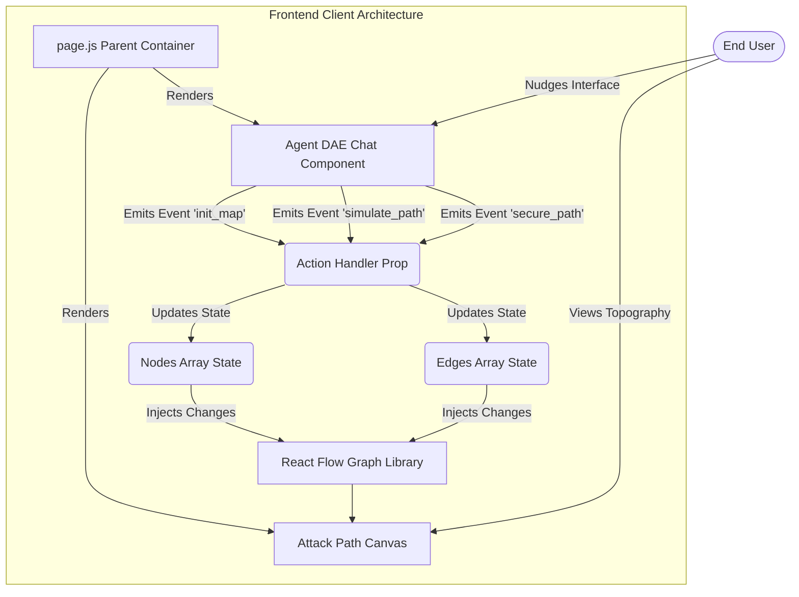
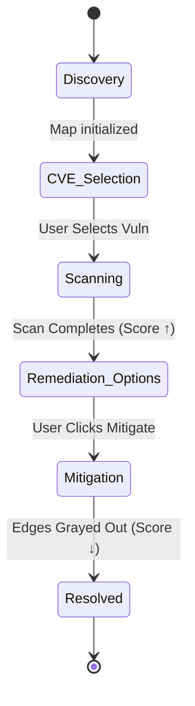

# Dynamic Agentic Experience (DAE) - Architectural Overview

This document outlines the high-level architecture of the DAE demonstration application, detailing the interplay between the Next.js framework, the conversational AI interface (Agent DAE), and the dynamic graph engine (React Flow).

## Core Technologies
* **Framework:** Next.js (React) leveraging modern App Router concepts.
* **Component State:** React Client Components (`"use client"`) enforcing unidirectional data flow.
* **Graph Engine:** React Flow - powers the massive scaling capabilities for visual topologies.
* **Styling:** Custom Vanilla CSS encapsulating premium dark-mode, glassmorphism, and dynamic animations.

## System Interaction Diagram

The application is structured to decouple the conversational intent engines from the visual canvas mapping engine. Actions triggered inside the conversational UI dynamically broadcast instructions up to the parent layer, which securely modifies the graph topography.

## Agent Workflows & State Machines

### 1. The Conversational Engine (`AgentDaeChat.js`)
A highly sophisticated state machine manages the narrative progression seen in the TruConfirm architecture.

### 2. The Attack Graph Logic
React Flow uses an absolute coordinate map populated dynamically:
- **`nodes` array:** Defines entities (UAT, Shadow API, Container Escape). Contains unique stylization tags.
- **`edges` array:** Maps relationships (`eA-B`). Receives dynamic `animated: true` tags and red stroke styling when the *Simulation* event fires from the Chat UI.

### Scaling Path Forward
While currently driving mock states on the frontend using React Hooks, this architecture is fully modularized. If required, the exact event payload logic firing from the chat buttons could instantly be re-routed to real localized `src/app/api/` micro-services parsing Amazon Neptune or Neo4j calculations.
