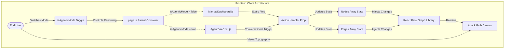
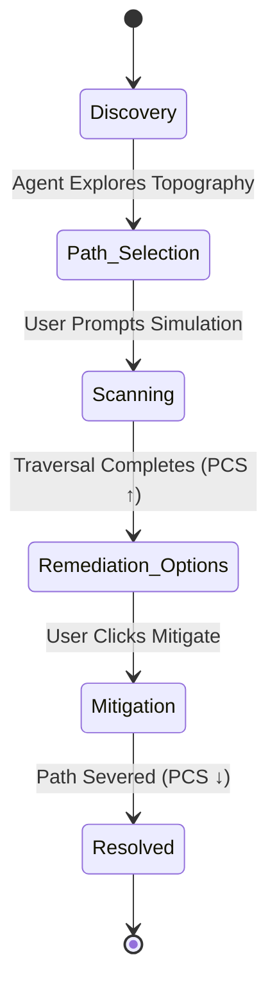

# Dynamic Agentic Experience (DAE) - Architectural Overview

This document outlines the high-level dual-mode architecture of the DAE demonstration application. It details the interplay between the Next.js framework, the foundational React Flow map engine, and the two interchangeable user interaction layers: The **Manual Dashboard** and the **Agent DAE Conversational AI**.

## Core Technologies
* **Framework:** Next.js (React) leveraging modern App Router concepts.
* **Component State:** React Client Components (`"use client"`) enforcing unidirectional data flow.
* **Graph Engine:** React Flow - powers the massive scaling capabilities for visual topologies.
* **Styling:** Custom Vanilla CSS encapsulating premium dark-mode, glassmorphism, and dynamic animations.

## System Interaction Diagram

The application is structured around a centralized Toggle State situated in the parent Dashboard. Based on `[isAgenticMode]`, the architecture routes events either through a static manual interface, or a dynamic conversational intelligence state-machine.

## Modular Dual-Mode Workflow Mapping

### 1. Manual Dashboard Baseline (`ManualDashboard.js`)
Serves as the narrative baseline (the old way). It accesses the `React Flow` components by dumping all `initialNodes` immediately onto the canvas without animation. Its triggers (`onSimulate`, `onMitigate`) push brute-force state changes without calculating underlying sub-graphs.

### 2. The Conversational Engine (`AgentDaeChat.js`)
A highly sophisticated state machine manages narrative progression mimicking the DAE workflow. It translates Attack Path mechanics (e.g., *Path Criticality Score (PCS)*, *Lateral Movement Nexus*) into a chat interface.

### Scaling Path Forward
The `isAgenticMode` centralized state proves that the underlying data (the graphical nodes arrays) is entirely decoupled from the presentation and manipulation layer. It can accept inputs from a static UI table just as easily as an NLP-driven chatbot.
