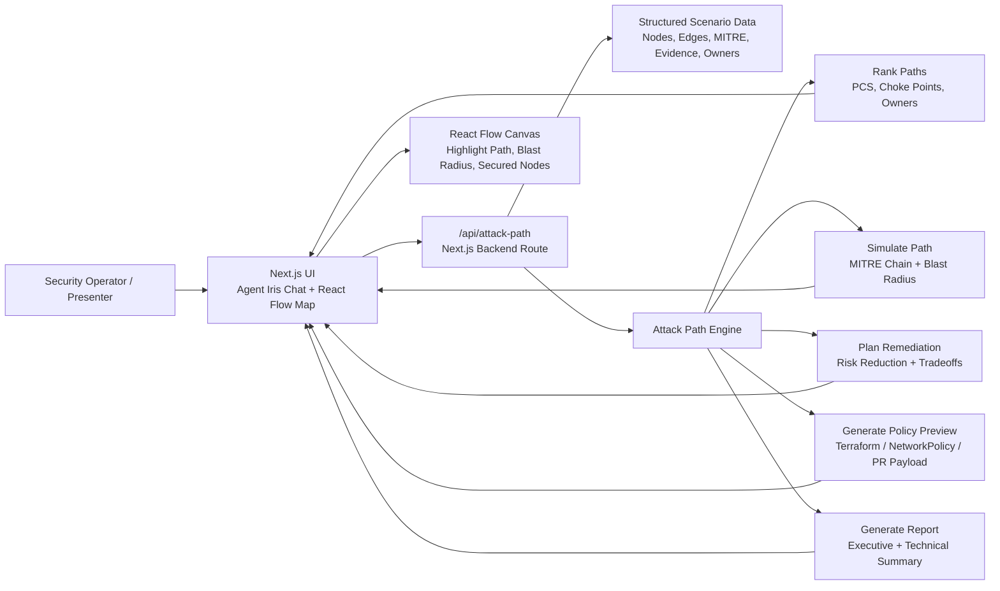
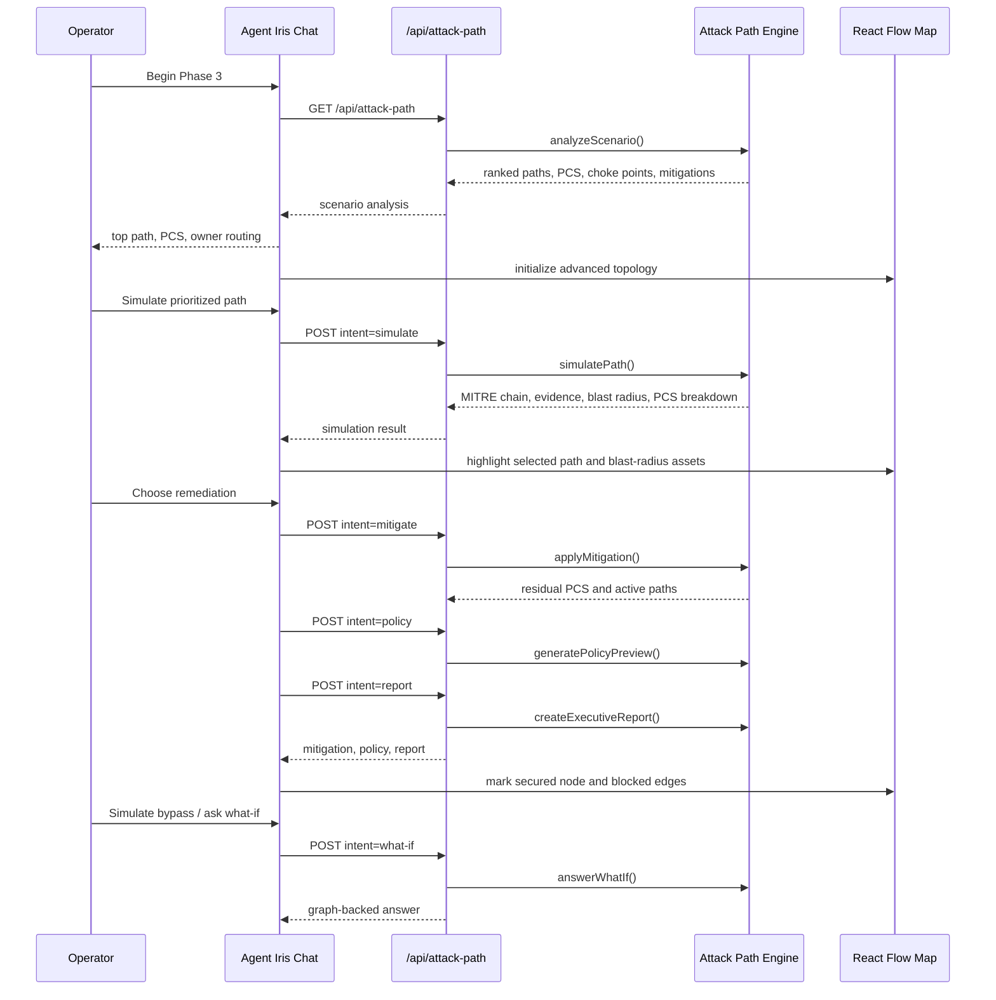
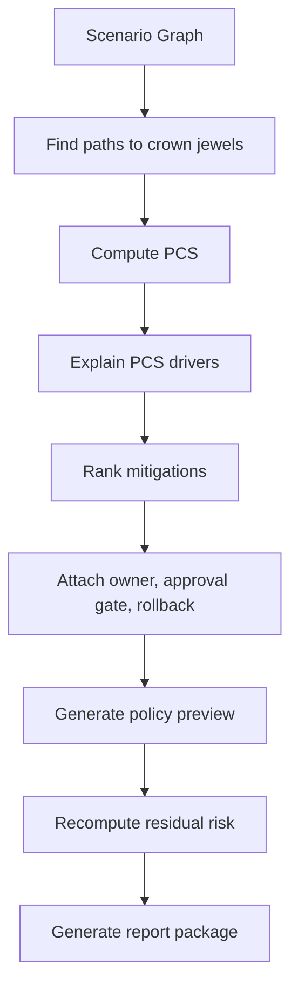

# Agent Iris Workflow

This document explains the current Agent Iris attack-path workflow after the Codex changes on the `codex-changes` branch. The demo now uses an integrated Next.js frontend and backend: the React chat and React Flow canvas call `/api/attack-path`, and the backend performs deterministic attack-path ranking, simulation, mitigation planning, policy preview, and report generation.

## Visual Flow

## Phase 1: Manual Baseline

Manual Dashboard mode is still the contrast experience. It shows the older SecOps workflow:

1. Static topology appears immediately.
2. The operator manually starts a ping trace.
3. The UI shows a static alert.
4. The operator deploys a manual fix.
5. The map grays out the affected path.

This phase demonstrates friction: the graph is not reasoning, there is no backend path ranking, and mitigation impact is not computed.

## Phase 2: AI Agent Posture Validation

Phase 2 remains a focused AI-agent posture story:

1. Agent Iris maps the Finance AI application chain.
2. The UI flags the AI agent as internet exposed and connected to sensitive customer data.
3. The operator authorizes a safe prompt-injection simulation.
4. Agent Iris demonstrates the risk of data exfiltration.
5. The remediation flow simulates a developer handoff and secure egress fix.

## Phase 3: Advanced Command Center

Phase 3 is the primary upgraded workflow.

## Backend Intents

The backend supports these API intents:

| Method | Intent | Purpose |
| --- | --- | --- |
| `GET` | none | Load scenario graph, ranked paths, PCS, choke points, and mitigation options. |
| `POST` | `simulate` | Return selected path, MITRE sequence, evidence chain, PCS breakdown, and blast-radius assets. |
| `POST` | `mitigate` | Apply selected mitigation and recompute residual PCS and active paths. |
| `POST` | `policy` | Generate policy-as-code or PR-style remediation preview. |
| `POST` | `report` | Generate executive and technical report package. |
| `POST` | `what-if` | Answer graph-backed scenario questions. |

## UI Workflow

1. Open the app at `http://127.0.0.1:3000`.
2. Toggle from `Manual Dashboard` to `Agent Iris`.
3. Select `Phase 3: Advanced Command Center`.
4. Review backend-ranked active paths, top PCS, choke point, and owner routing.
5. Click `Simulate Prioritized Path & Blast Radius`.
6. Review MITRE sequence, evidence, exposed blast-radius assets, and PCS explanation.
7. Choose a remediation option.
8. Review paths closed, PCS reduction, downtime, owner, approval gate, and rollback context.
9. Click `Show Policy Preview` to see generated remediation payload.
10. Run bypass simulation.
11. Ask a what-if question in the Phase 3 input.
12. Generate the Agent Iris report package.

## Decision Model

## PCS Explanation

The Path Criticality Score is now shown as a breakdown in the UI. The backend explains:

- exploit confidence
- crown-jewel business value
- blast-radius contribution
- convergence/choke-point contribution
- final normalized PCS

This makes Agent Iris more transparent: the operator can see why a path is urgent instead of only seeing a single score.

## Remediation Planning

Each remediation option now includes:

- target node
- affected owner/team
- blocked edges
- paths closed
- PCS reduction
- deployment time
- downtime
- approval gate
- rollback guidance
- generated policy or PR-style preview

## Report Package

After mitigation and bypass testing, Agent Iris can generate a report package containing:

- executive headline
- business impact
- technical summary
- recommended action
- approval gate
- rollback plan

This supports both executive storytelling and technical handoff.
